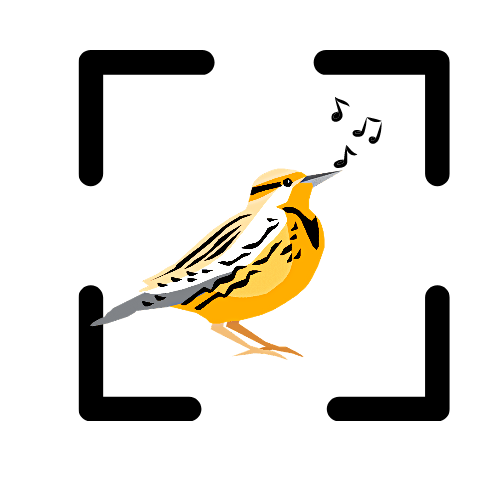

# Bird_Scanner

These scripts and workflow (https://jkauphus.github.io/Bird_Scanner/) are to develop an R ecosystem and eventual application to run the Bird-Net Algorithm in R.

These scripts are modified on the NSNSDAcoutics R package that leverages the Bird-Net tensorflow model to extract avian calls through wav files in a very streamline and intuitive manor.

Main script titled, `bird_scanner.R`, will batch run the bird-net model to analyze multiple wav files and output a table with the predicts species within each wave file analyzed. From there, using the `bird_checker.R` script will then analyze suspicious calls predicted from the model by outputting a segment of the audio recording and a spectrogram.

From more information on using BirdNet and how the model works visit the Journal Article here: https://www.sciencedirect.com/science/article/pii/S1574954121000273.
