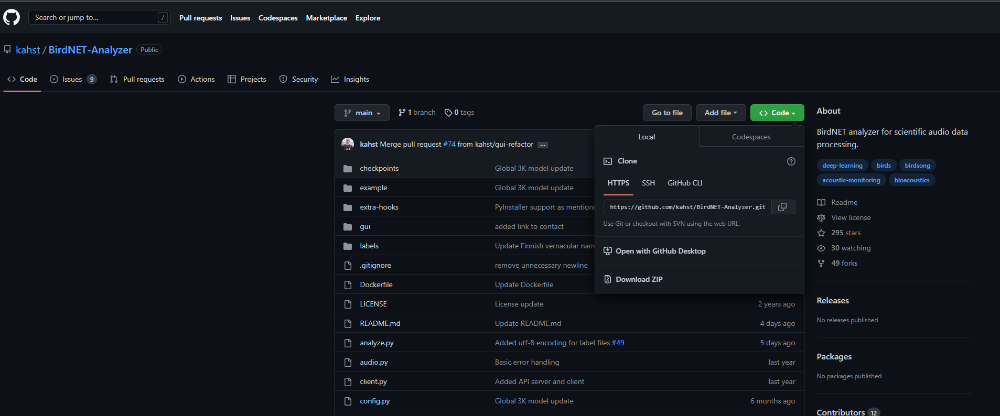
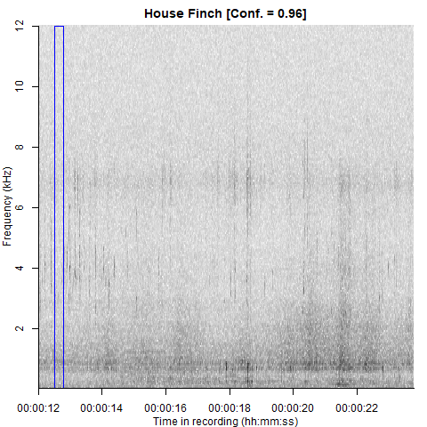

```{r Packages Used, include=FALSE}
# Packages Used
library(knitr)
library(webshot)
library(NSNSDAcoustics)
library(tidyverse)
library(openxlsx)
library(glue)
library(htmltools)
```

# 1. Introduction

$~$

This document was inspired by noticing the convergence of artificial intelligence with ecological research and the ground breaking development of the <a href="https://birdnet.cornell.edu/"> BirdNET</a> algorithm developed by Dr. Stefan Kahl with the K. Lisa Yang Center for Conservation Bioacoustics at the Cornell Lab of Ornithology. <a href="https://www.sciencedirect.com/science/article/pii/S1574954121000273"> BirdNET Paper</a>.

$~$

Birdnet is an machine learning model developed using the tensorflow algorithm, which is a software library developed by Google to be used to develop AI models that can make predictions based on a large dataset of pre-trained data. Birdnet is trained based on hundreds of thousands of bird calls from Cornell Lab of Ornithology across various species, and can provide predictions for around 3,000 bird calls worldwide (as of 2023). To simply put it, if you have an audio file with various bird calls, BirdNET can be used to identify which species are calling in the given audio-file, at which time of the audio, and to what degree it believes that species to be. If you think you want to have this software available, this document is going to show you the steps I have developed to streamline a weeks worth of audio files to be processed to see which species occur in a given area.

$~$

Now, before I explain my process, I want to highlight some alternatives that can be done with BirdNET. BirdNET was developed in Python, therefore, if you have a real foundation in the Python language, I encourage you to explore Dr. Kalh's <a href="https://github.com/kahst/BirdNET-Analyzer"> github repository</a>. In the github repo, Dr, Kahl explains how one would set up the python environment and run the model through either Ubuntu or Windows. There is an option to use a GUI he developed to run BirdNET on your audio files, but if you want to run multiple files with one command, compile the results into one table, and have validation tools to check predictions, I encourage you to explore my option. Finally, within Dr. Kahl's github repository, he provides other projects that have used BirdNET to identify birds in real time from ARU units.The only issue with these projects is that they require LTE connectivity, therefore, not the greatest help for a typical biological ARU survey.

$~$

If you have decided to go through my alternative framework on how I have been using BirdNET for both species investigation and potential incorporation to ESA surveys, below I will run a step-by-step process from recording the data from the field to processing the audios on my Windows Laptop.

$~$

The only pre-requisites required for my framework is a general understanding of the <b>R language</b> and <b>Git</b>, which for most young biologists that have went through Graduate School, should have a fundamental understanding. If you are one who is not familiar with R & Rstudio, I suggest you watch [[**this quick video.**]{.ul}](https://www.youtube.com/watch?v=lVKMsaWju8w&amp;t=52s).

# 2. The Framework

$~$

{width="400"}


$~$

A) Deploy Autonomous Recording Units (ARUs) into the field of study.

B) Download the audio recordings to the computer, and convert the wav and/or mp3 files to "SITEID_YYYYMMDD_HHMMSS" format. 

C) Set-up BirdNET with the <a href="https://github.com/nationalparkservice/NSNSDAcoustics"> NSNSDAcoustics package</a> developed by Cathleen Balantic with the National Parks Service.

D) Run your modified version of the "bird_scanner.R" R script from the <a href="https://github.com/jkauphus/Bird_Scanner"> Bird-Scanner Repository</a>.

E) Check predictions using the "bird-checker.R" script

# 3. Deploying ARUs

An autonomous recording unit, otherwise known as an ARU, is a self-contained audio recording device that is deployed in marine or terrestrial environments for bioacoustic monitoring. The unit is used in both marine and terrestrial environments to track the behavior of animals, identify sensitive species occurring in an area, gauge habitat quality, and monitor the ecosystems.

$~$

Within the last two decades, ARUs have been growing in popularity for use in studies on birds, cetaceans, primates, bats, anurans, and insects. However, for most of the history of deploying these ARUs into the field, would require costly (>$1,000) units and long hours of downloading and processing the audio data into distilling down where species were calling based on known experience of species specific calls.

$~$

With the advancements in the bioacoustic industry today, and manufacturing overall, the costs associated with ARUs has drastically decreased for the entry-level devices (<$300). The three big players of the bioacoustic ARUs that I recommend using are <a href="https://www.wildlifeacoustics.com/"> Wildlife Accoustics</a>, <a href="https://www.openacousticdevices.info/audiomoth"> Open Acoustics Audiomoths</a>, and <a href="https://www.birds.cornell.edu/ccb/swift-one/"> SwiftOne by Cornell Labs</a>. 

$~$

My firm has obtained two ARU devices that I would recommend as a staring point with Bird-Scanner; the Audiomoth v1.2.0, which is a relatively cheap (<$150) audio device that has a bit of a learning curve, but was my go to device for deployment for the entire 2022 field season.

$~$

{width="400"}


$~$

The other device was from Wildlife Acoustics: Song Meter Micro, which was simple to set up and has an app to configure the recording times. The device retails for $250, which is a bump up in price compared to the Audiomoth, however, these devices are backed by a greatly reputable company.

$~$

{width="400"}


$~$

For this walk through on Bird-Scanner, I deployed an ARU in my backyard under my bird feeder, which was set up to start recording from 6:00 - 19:00 and recorded a 5 minute segment of audio every 15 minutes, which equates to 52 wav files for the day. At the end of a recording session, at the birdfeeder, I walked out to the device, popped it open, then removed the SD card, and plugged the card into my laptop.

$~$

{width="677"}

$~$

Currently, I have only deployed Bird-Scanner at 12 locations across the Navajo Nation during habitat assessment surveys to assist in determining species that occur within or near the project area. So far Bird-Scanner has improved my detection ability of birds for my project (which, are the addition of birds identified by Bird-Scanner from the birds I am observing while conducting the survey) reports by 25%.

# 4. Download Audio Data

To download the wav files from the ARU, plug the micro-SD card from the device into your computer, and transfer the files over into a folder of your choice (personally, I have a folder in my Documents folder that holds all my recordings based on each recording effort). Another alternative would be to save them under the data folder in the `Bird-Scanner` repository (refer to section 5).

$~$
EX:) `C:\Users\jkauphusman\Documents\Recordings\Birdfeeder`
$~$

Now, to run Bird-Scanner, you need to rename your files into this format `SITEID_YYYYMMDD_HHMMSS`, likely based on the device you are using your files should already include the date metadata format (ex: 20220806_140730) or if you are using the Wildlife Acoustic Mini your files will already be labeled like this `SMM07526_20221213_090202.wav`. To run Bird-Scanner, it is important that each file has a site label followed by the date, otherwise the bird_scanner.R script will not run. If your files are labeled the Wildlife Acoustic format proceed to the next step, otherwise, you will need to implement a  site label (ex: `Birdfeeder_20220806_140730.wav`). If you don't want to sit and rename each wav file, I have a script I developed in this repository `./code/file_renamer.R` which should give you a great jumping off point to auto-rename the files to your liking.

# 5. BirdNET and NSNSDAcoustics

To set up BirdNET on your laptop, the minimum requirements you will need is a general understanding of conda environments and how they interact with `r-reticulate package`, which I will walk you through. I will try to make this process as simple as possible, but reach out to me if you get stuck. One of the issues with BirdNET is that it will only run results on one file at a time, must be run in terminal, and lacks the data management power that R clearly has the edge over. So to bring the best of both worlds, I chose to develop my workflow with R leveraging the great <b>NSNSDA Acoustics</b> R package. 

Below, I will show you my process on how to set up BirdNET to run with this repository, but I highly suggest you to read through the <a href="https://github.com/nationalparkservice/NSNSDAcoustics"> NSNSDAcoustics package</a> tutorial information since we will be heavily using this package to  run BirdNET on our recordings.

$~$

<b>A)</b> First, you will need to download the <a href="https://github.com/kahst/BirdNET-Analyzer"> BirdNET Analyzer Repository</a>, unsure how to do that, click the "Code" button on the repository's github page and then select download zip. From there just drag and unzip the folder into your <b>documents</b> folder. Warning you must have this file in your documents folder on your pc for this workflow to run properly with the NSNSDAcoustics package.

$~$

{width="800"}


$~$

From there place the BirdNet Analyzer folder into your documents folder on your computer

`C:\Users\Username\Documents\`

<b>B)</b> Go ahead and download <a href="https://www.anaconda.com/"> Anaconda</a> for Windows. Following the download you will need to open the "Anaconda Prompt" terminal.

{width="200"}

In the terminal run the following commands:

`conda create -n pybirdanalyze python=3.7`

This creates the conda environment to run BirdNET

`conda activate pybirdanalyze`

This will activate the conda environment

`pip install --upgrade pip`

This will create an installer to install the needed BirdNET extensions more smoothly

`pip install tensorflow`
`pip install librosa`
`pip install numpy==1.20`

Those last few commands will download the extensions so that we can start running BirdNET

$~$

<b>C)</b> Now we need to move to files from the BirdNET folder to the conda environment. 

Open up the BirdNET-Analyzer folder and copy two files

* the `checkpoints` folder
* `eBird_taxonomy_codes_2021E.json` file

From there, open up the conda environment folder, the path should be something like this 

`C:\Users\Username\Anaconda3\envs\pybirdanalyze`

{width="1000"}
$~$

And with that you should be done with the hardest part of setting up Bird-Scanner.

<b>D)</b> Download or git clone the <a href="https://github.com/jkauphus/Bird_Scanner"> Bird-Scanner Repository</a>. 

{width="800"}

If you do not understand github and its uses with R watch [[**this quick video.**]{.ul}](https://www.youtube.com/watch?v=kL6L2MNqPHg)

I would recommend downloading bird-scanner into you documents folder. From there, open RStudio and open the `Bird_Scanner.Rproj`.

In the repository, under the "code" folder open the "setup_env.R" file and change the paths for the

`Sys.setenv(RETICULATE_PYTHON = "C:/Users/jkauphusman/Anaconda3/envs/pybirdanalyze/python.exe")`

and

`birdnet_model <- "C:/Users/JKauphusman/OneDrive - Logan Simpson/Documents/BirdNET-Analyzer-main"`

to the paths on your computer, based on your username, of where your conda env and BirdNet Analyzer folders are located. Then run the script (hint you need to install the following R packages if you have not already). Remember to keep this "setup_env.R" script within your repository so you can call to it when you run "bird_scanner.R".

Now install the following packages so that you have no issues with the Bird-Scanner-Workflow:

`install.packages(c("reticulate", "tidyverse", "devtools", "glue", "openxlsx", "readxl", "tuneR", "ggplot2", "umap", "seewave", "phonTools", "signal", "warbleR"))`

Now run the following commands to download the `NSNSDAcoustics r package`

`library(devtools)`
`devtools::install_github('nationalparkservice/NSNSDAcoustics')`

If there are no errors, you should be able to run the `bird_scanner.R` script.

# 6. Run Bird-Scanner

Below, is an example and tutorial to show you how Bird-Scanner is operated following the collection of audio files from your deployed ARU. When I run my calls following a field session, I will use the `bird_scanner.R` script, found within the code folder of the Bird-Scanner Repository, which will auto-ID bird calls within the recordings, and output the results in a excel table format that will include: species, time of call, model prediction percentage, and when in the recording the model heard the call. For each session with `bird_scanner.R` all I change is the filepaths, location information, and confidence thresholds.

$~$
If you remember at this point of the workflow, we have collected audio files at my bird feeder and loaded the wav files to my computer. After that we verified the files were named in the proper format `SITEID_YYYYMMDD_HHMMSS`.

Here is an example of one of those recordings at the bird-feeder:

```{r ARU Example Recording, echo=FALSE, message=FALSE, warning=FALSE, results='asis'}
audio_player <- tags$audio(
  src = "./data/SMM07526_20221213_130202.wav",
  type = "audio/wav",
  controls = NA
)
audio_player
```

$~$

Lets look at how the file names of the recordings should look like:

```{r ARU Data, echo=TRUE, message=FALSE, warning=FALSE}
files <- list.files("./data/", recursive = TRUE, full.names = FALSE)
file_names <- data.frame(files[1:5])
knitr::kable(file_names, format = "html", caption = "Recording Filenames")
```
As you can see, the files are in the needed format: `SITEID_YYYYMMDD_HHMMSS`, but with my Song Meter Micro, I have the ARUs name (SMM07526) instead of the site name, but it should run the model fine with no issue.

Referring to the `bird-scanner.R` script, I will walk through the necessary steps to run BirdNET on our gathered recordings.

First, run the `setup_env.R` script and then load in the filepath and designate an output folder. The `setup_env.R` script is needed to activate your conda environment. If you are confused with the `glue()` function, it essentially pastes in text based on the saved object with the `{}`. So below if I run 

`data <-glue("{path}data)` it saves data as "C:/Users/jkauphusman/Desktop/Scripts/Bird_Scanner/data", which for this tutorial all my wav files are saved under the data folder in the Bird-Scanner Repository.

Anywho, lets run the following code:

```{r Bird-Scanner Generals, echo=TRUE, message=FALSE, warning=FALSE}
# Load in the Birdnet conda environment
source("./code/setup_env.R")
# set the file path
path <- "C:/Users/jkauphusman/Desktop/Scripts/Bird_Scanner/"
# Load in the file path of where the data is located, you will need the entire path
data <- glue("{path}data")
# Designate the output folder
output <- glue("{path}", "results-directory")
```

Now, you need to identify where your ARUs were deployed, which the coordinates will need to be in lat-long format. The BirdNET model will use these coordinates to reduce the amount of species it can use to predict based on the range data for birds identified by the Cornell Labs of Ornithology and eBird.

```{r Corrdinates information, echo=TRUE}
latitude <- 33.273595
longitude <- -111.829824
```
Another prerequisite is to define the confidence threshold that you want BirdNet to abide to. There are various strengths and weaknesses for a higher or lower threshold, so if you want to reduce false positives or false negatives based on your analysis you'll need to decide what threshold is best for you. I have designated 70% to decrease false positives so that when the model is making a prediction it is very accurate.

```{r conf information, echo=TRUE}
conf <- 0.75
```

With those prerequisites out of the way, we can run the audio files through the BirdNET Model.

```{r BirdNet Model, echo=TRUE, message=FALSE, warning=FALSE}
birdnet_analyzer(audio.directory = data,
                 results.directory = output,
                 birdnet.directory = birdnet_model,
                 use.week = TRUE,
                 lat = latitude,
                 lon = longitude,
                 min.conf = conf)
```

One item that is important to review following the results from BirdNET is the pool of potential species the model is predicting from based on the distribution information of avian species that occur in a given area, which is pre-trained into BirdNet from eBird and Cornell Labs information. Run the following code to extract the specific species list used during the BirdNet run based on the coordinates provided. Here are the potential species that can occur by my bird feeder (i.e., the greater Phoenix, AZ area). FYI, this is a long list so you can scroll really fast to the next code chunk.

```{r Potential Species list}
source("./code/species_list.R")
spec_list <- spec_list()
spec_list
```

Now we need to aggregate the BirdNET output into one master table for us to interpret

```{r message=FALSE, warning=FALSE}
birdnet_format(results.directory = output,
               timezone = 'MST') # Double Check due to timezone changes

results_table <- birdnet_gather(results.directory = output,
                  formatted = TRUE)
```

To export the data in an excel table that contains both the BirdNET results and the potential species, run the following lines of code with the `openxlsx` library to create an excel workbook with both tables of information on each sheet: 

`workbook <- createWorkbook()`
`results <- addWorksheet(workbook, "BirdNET Results")`
`Spec <- addWorksheet(workbook, "Potential Species in Project")`
`writeData(workbook, Spec, spec_list)`
`writeData(workbook, results, results_table)`
`saveWorkbook(workbook, glue("./results_table/{SiteName}_results_table.xlsx"), overwrite = TRUE)`

Below are the first 5 results from BirdNET from our Bird-feeder recordings.

```{r Table, echo=FALSE}
knitr::kable(results_table[1:5])
```

Quick Tip, if you run `bird-scanner.R` remember to either clear your results-directory folder if you run the script again to the same folder.

Again, all these steps on running BirdNET on your ARU calls should be ran through the `bird-scanner.R` script provided in the <a href="https://github.com/jkauphus/Bird_Scanner"> Bird-Scanner Repository</a>.

# 7. Check Predictions

Let's say you ran BirdNET, and it predicted a species like "House finch" and you wanted to make sure that prediction was correct, here in the Bird-Scanner Workflow repository, I wrote some functions to extract a segment of the audio file when exactly in the given audio segment the model predicted the species and how to convert the audio into a spectrogram. To see how I typically run this code, in the <a href="https://github.com/jkauphus/Bird_Scanner"> Bird-Scanner Repository</a> under the `code` folder check out the `bird_checker.R` script, which will give you a tutorial of how to verify the model's predictions. So, if you want to look at just the "House Finch" calls you can extract those results.

```{r}
### What species or observation do you want to verify?

species <- "House Finch"

# create a sub table of the calls you want to investigate, lets just take the first two entries
verify <- results_table[1:2] %>% 
  filter(common_name == glue("{species}"))
```


Then using the `bird_verify` function I developed for this workflow, you can output the audio segments of when the model predicted "House Finch" to the `checker` folder in the repository, and quickly listen to the audio segments.
```{r}
# Read in the bird_verify function
source("./code/bird_verify.R")
# execute the function to the sub-table of house finch calls
bird_verify(verify)
# now check the outputs in the checker folder
```

Here is the example of the audio segment of the first predicted House Finch call

```{r Verify Model, echo=FALSE, message=FALSE, warning=FALSE, results='asis'}
audio_player <- tags$audio(
  src = "./checker/1_Haemorhous mexicanus_SMM07526_20221213_090202.wav",
  type = "audio/wav",
  controls = NA
)
audio_player
```

As you can see the model predicted correctly. If you wanted further verification, using the `bird_checker.R` script in the code folder you can output the spectrograms of the predicted audio segment using the `bird_spec` function. This function will create spectrograms for all the verify species you have aggregated and output the spectrograms in PNG files in the `spectrograms` folder of the Bird-Scanner Repository.

```{r Spectrograms, echo=TRUE, message=FALSE, warning=FALSE}
# Read in the bird_verify function
source("./code/bird_spec.R")
# execute the function to the sub-table of house finch calls
bird_spec(verify)
# now check the outputs in the checker folder
```

And there is the first prediction of the house finch in a spectrogram of when the model made the prediction. Just some backrground information, the function buffers out the predicted call by one second at the start and end of the prediction, so below in the spectrogram the model identified the call at seconds 1-4s.

{width="350"}

Before you run `bird_checker.R` again, make sure to delete the wav and png files in both the `checker` and `spectrograms` folder.

# 8. Final Thoughts

With that, I leave you with a step-by-step tutorial of the Bird-Scanner workflow, which will give you everything you need to set up your workflow with the <a href="https://github.com/jkauphus/Bird_Scanner"> Bird-Scanner Repository</a>.

I hope you will find the great applicability of using BirdNET for your avian species analyses, including the use of this workflow for various avian ESA species surveys.

If you have any questions feel free to leave a comment in the issues section of the Bird-Scanner Repository or contact me directly.

THANK YOU!!


